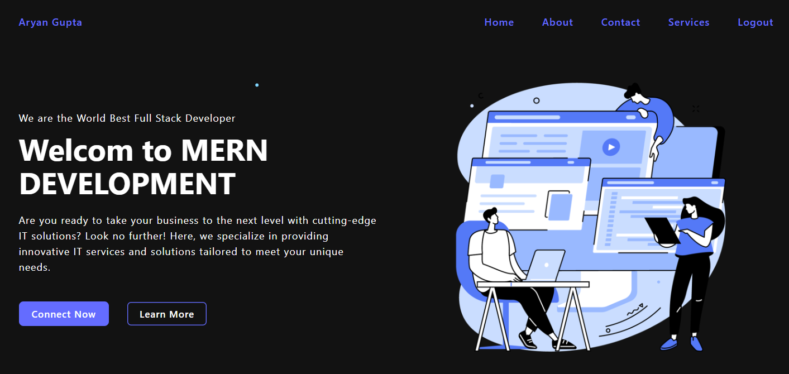
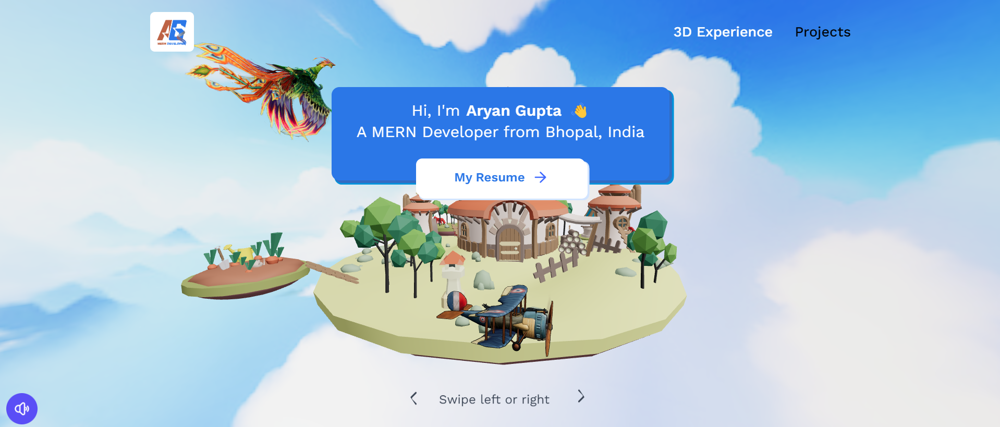
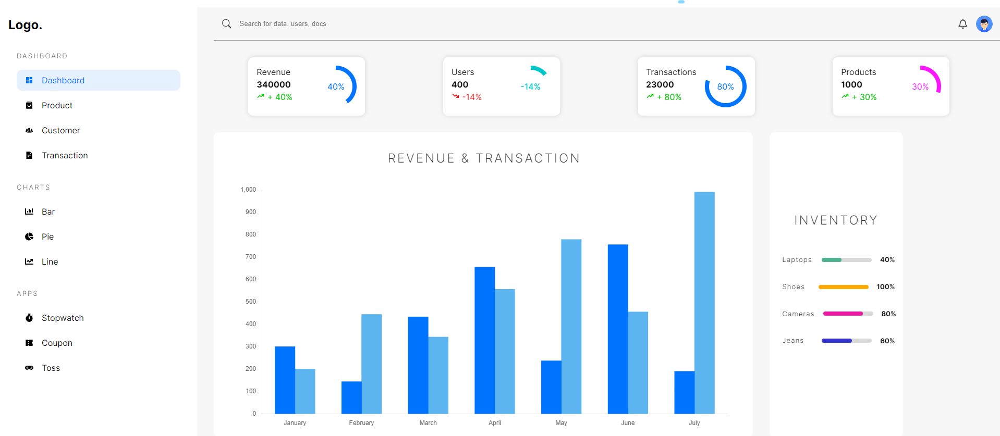
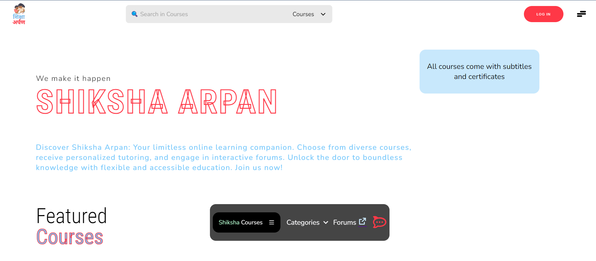

  
  
  

# Hello Folks!  I'm Aryan Gupta.

 <!-- Profile views -->
 
 
 
I'm a Fullstack Developer.
  
  I'm from India, living in Bhopal and currently studying Computer Science.
  
<!--   I am motivated by the power of technology as a tool for positive change, with a background in Math, Physics, and Engineering. -->

<!-- See [my website](https://rahulkarda.netlify.app) for more information!    
You can also find me on [![Twitter][1.2]][1],  or on [![LinkedIn][3.2]][3].
website -->

🌱 Exploring new technologies and developing software solutions and quick hacks.

👯 I’m looking to collaborate on different projects

👨‍💻 All of my projects are available at [my website](https://portfolio-3d-livid.vercel.app/)

📝 I actively post on [LinkedIn](https://linkedin.com/in/agaryan)

👀 Ask me about React, NodeJS, Spring, Springboot, Rest APIs.

📫You can reach me at 911aaryan@gmail.com

⚡ I belive, a perfect cup of coffee can be the ultimate solution for any stress.

 

<h3>🛠 Tech Stack</h3>

💻 &nbsp; Java | C++

🌐 &nbsp; HTML | CSS | SASS | JavaScript | Tailwind | React | JSP

🛢 &nbsp; Node.js | Express.js | Spring | Spring Boot | MongoDb | MySql | Oracle | Firebase

🔧 &nbsp; Visual Studio code | Eclipse | Project Idx | Postman |

🖥 &nbsp; Figma

# Projects ⚙️

<!-- <h1 align="center">Projects</h1> -->
<table bordercolor="#66b2b2">
  
  <tr>
    <td width="50%" valign="top">
      <h3 align="center">GET TALA WEBSITE</h3>
         
        
         
        

           
    
  
      

        
<strong>HTML, CSS, JAVASCRIPT, GSAP</strong> - Get Tala Website:  a stylish website showcasing fruit-based snacks with GSAP animations, echoing taglines such as 'Bringing fruit snacks back to their roots,' emphasizing natural flavors and quality ingredients.

    </td>
    <td width="50%" valign="top">
      <h3 align="center">DIGITAL PORTFOLIO</h3>
         
      
         
        

    
   
  
      

        
<strong>REACT, NODEJS, EXPRESSJS, MONGODB</strong> - DIGITAL PORTFOLIO : LMS Digital revolutionizes online education with its modern Learning Management System.

    </td>
  </tr>
  
  <tr>
    <td width="50%" valign="top">
      <h3 align="center">Portfolio App</h3>
       
        
       
        

           
  
  
      

        
<strong>React, Three-Fiber, threejs, TailwindCSS</strong> - Portfolio Site including links to my projects and ways to get in contact with me.

    </td>
    <td width="50%" valign="top">
      <h3 align="center">ECOMMERCE DASHBOARD</h3>
         
        
         
        

           
  
  
      

        
<strong>REACT, TYPESCRIPT, SASS, REACT-TABLE, CHART-JS-2</strong> ECOMMERCE DASHBOARD - React, TypeScript, and SASS-powered. Features interactive data tables, dynamic charts, and a fun guessing game with instant feedback.

    </td>
  </tr>
  
   <tr>
    <td width="50%" valign="top">
      <h3 align="center">SHIKSHA ARPAN</h3>
       
        
       
        

           
  
  
      

        
<strong>HTML, CSS, JAVASCRIPT, GSAP</strong> SHIKSHA ARPAN - The Shiksha Arpan Platform offers an intuitive, user-friendly interface featuring a Community Discussion Forum and an Enhanced Tutor Matching Algorithm for seamless academic assistance and knowledge sharing.

    </td>
    <td width="50%" valign="top">
      <h3 align="center">SHIKSHA ARPAN</h3>
       
        
       
        

           
  
  
      

        
<strong>HTML, CSS, JAVASCRIPT, GSAP</strong> SHIKSHA ARPAN - The Shiksha Arpan Platform offers an intuitive, user-friendly interface featuring a Community Discussion Forum and an Enhanced Tutor Matching Algorithm for seamless academic assistance and knowledge sharing.

    </td>
  </tr>
</table>

 

# GitHub Stats 📈

&nbsp;&nbsp;&nbsp;&nbsp;

  

<!--  -->

  

  

  

<!-- 

<a href="https://github.com/rahulkarda/Web-Postman">
  

 -->

  

<!-- ## Blog & Writing &#x270d;

Apart from coding, I also maintain a blog - you can find my articles on my website at [rahulkarda.netlify.app](https://rahulkarda.netlify.app) as well as on [Medium](https://medium.com/@rahulkarda2002) and [DEV.to](https://dev.to/rahulkarda). -->

## Extras 📝

  

  
Click to expand!

   
    

 

  
  

  
  

   
    

      
    

   
    

<!--
A sample of my recent articles:

<!- BLOG-POST-LIST:START ->
- [Python f-strings Are More Powerful Than You Might Think](https://bit.ly/3uETfbi)
- [Ultimate CI Pipeline for All of Your Python Projects](https://bit.ly/3MI4Iz0)
- [Optimizing Memory Usage in Python Applications](https://bit.ly/3M30D82)
- [Upcoming Python Features Brought to You by Python Enhancement Proposals](https://bit.ly/3oMJ6qR)
<!- BLOG-POST-LIST:END ->
-->

<!-- links to social media icons -->

<!-- icons with padding -->

[1.1]: http://i.imgur.com/tXSoThF.png "twitter icon with padding"
[2.1]: http://i.imgur.com/0o48UoR.png "github icon with padding"

<!-- icons without padding -->

[1.2]: http://i.imgur.com/wWzX9uB.png "twitter icon without padding"
[2.2]: http://i.imgur.com/9I6NRUm.png "github icon without padding"
[3.2]: https://raw.githubusercontent.com/MartinHeinz/MartinHeinz/master/linkedin-3-16.png "LinkedIn icon without padding"

<!-- links to your social media accounts -->

[1]: https://twitter.com/rahulkarda2002
[2]: https://github.com/rahulkarda
[3]: https://www.linkedin.com/in/rahulkarda/

<!-- default README.md -->
<!--
- 👋 Hi, I’m Rahul Karda
- 👀 I’m interested in Full Stack Web Development and other skills
- 🌱 I’m currently learning React
- 💞️ I’m looking to collaborate on different web dev projects
- 📫 How to reach me - You can contact me on rahulkarda2002@gmail.com
-->
